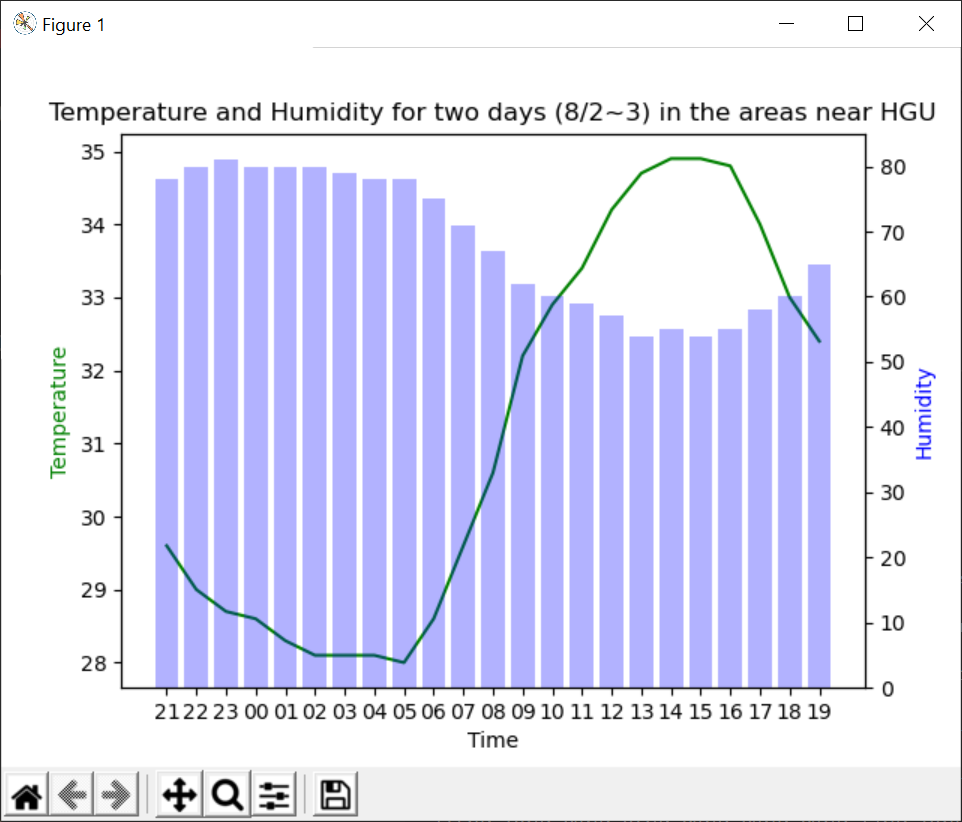

# WeatherPlot
It is a simple python program showing a chart for time-to-time weather information in areas near HGU(Handong Global University) for the last two days.        

   

The very things it can show are two, the degree of temperature and humidity.
X axle represents each time of the last two days.    
Left y axle represents the degree of temperatures and right y axle represents the degree of humidity over last 23 hours.   

## Getting access to Open API data and processing json formatted data to python lists       
````python
def getItems(base_date,base_time):

    url = "http://apis.data.go.kr/1360000/VilageFcstInfoService/getUltraSrtNcst"
    serviceKey = "Type the ServiceKey" #Type the Service Key you got after registered from the server
    dataType = "JSON"

    # Find nx and ny of the areas of which you want to get the data from the given excel file.
    nx = 102
    ny = 96
    
    option = "?serviceKey="+serviceKey
    request = "&dataType="+dataType+"&base_date="+base_date+"&base_time="+base_time+"&nx="+str(nx)+"&ny="+str(ny)
    url_full = url + option + request

    response = r.urlopen(url_full).read().decode('utf-8')
    jsonArray = json.loads(response) 

    # For the exception error.
    if jsonArray.get("response").get("header").get("resultCode") != '00':
        print("Error!!!")
        print(jsonArray.get("header"))
        return None

    items =jsonArray.get("response").get("body").get("items").get("item") 
    return items
````
**Result**
````
items>
[{'baseDate': '20200813', 'baseTime': '1800', 'category': 'PTY', 'nx': 102, 'ny': 96, 'obsrValue': '0'}, 
{'baseDate': '20200813', 'baseTime': '1800', 'category': 'REH', 'nx': 102, 'ny': 96, 'obsrValue': '58'}, 
{'baseDate': '20200813', 'baseTime': '1800', 'category': 'RN1', 'nx': 102, 'ny': 96, 'obsrValue': '0'}, 
{'baseDate': '20200813', 'baseTime': '1800', 'category': 'T1H', 'nx': 102, 'ny': 96, 'obsrValue': '34'}, 
{'baseDate': '20200813', 'baseTime': '1800', 'category': 'UUU', 'nx': 102, 'ny': 96, 'obsrValue': '1.3'}, 
{'baseDate': '20200813', 'baseTime': '1800', 'category': 'VEC', 'nx': 102, 'ny': 96, 'obsrValue': '202'}, 
{'baseDate': '20200813', 'baseTime': '1800', 'category': 'VVV', 'nx': 102, 'ny': 96, 'obsrValue': '3.2'}, 
{'baseDate': '20200813', 'baseTime': '1800', 'category': 'WSD', 'nx': 102, 'ny': 96, 'obsrValue': '3.5'}]
````

##  Searching the required value and stores them into lists
````python
def getValue(items,category):
    for item in items:
        if item.get("category")==category:
            return float(item.get("obsrValue"))
    print("error! not found")
    return None
    
def storeValuesIntoList(datelist):
    temperList=[]
    humidList=[]

    for date in datelist:
        item = getItems(date[0],date[1])

        value = getValue(item, const_temper)
        temperList.append(value)   
        value = getValue(item, const_humid)
        humidList.append(value)   

    return temperList,humidList
````
**Result**
````
temperate>
[29.8, 29.6, 29.0, 28.7, 28.6, 28.3, 28.1, 28.1, 28.1, 28.0, 28.6, 29.6, 
30.6, 32.2, 32.9, 33.4, 34.2, 34.7, 34.9, 34.9, 34.8, 34.0, 34.0]
humidity>
[77.0, 78.0, 80.0, 81.0, 80.0, 80.0, 80.0, 79.0, 78.0, 78.0, 75.0, 71.0, 
67.0, 62.0, 60.0, 59.0, 57.0, 54.0, 55.0, 56.0, 55.0, 58.0, 58.0]
````

## Drawing the chart by using matplotlib
````python
date, time = getNow()

x = setDateTimeList(date,time,23)
y1,y2 = storeValuesIntoList(x)

new_x=[]
for item in x:
    new_x.append(item[1][:2])

fig, ax1 = plt.subplots()
ax2 = ax1.twinx()

ax1.plot(new_x, y1, color='g')
ax2.bar(new_x, y2, color='b', alpha=0.3)

ax1.set_xlabel('Time')
ax1.set_ylabel('Temperature', color='g')
ax2.set_ylabel('Humidity', color='b')
plt.title("Temperature and Humidity for two days ("+x[0][0][5:6]+"/"+x[0][0][7:8]+"~"+x[len(x)-1][0][7:8]+") in the areas near HGU")
plt.show()
````
**Result**

   


# How to Execute?
Run the main.py That's it. Very simple!   

# Review
I was getting to make this program due to a kind of assignment. Because I haven't experienced the way to deal with OpenAPI data, I had to try to do so many things in order to learn by myself. There were three main problems to solve, including getting JSON formatted datasets from the server, processing the data to extract only what I needed, and drawing the chart from the data. Fortunately, I spent all day today to solve these problems, and finally completed the functions and algorithms. I think my code examples could be helpful someday for beginners like me to learn by themselves, and I hope it to be helpful. Thank you.

# License
Weather Data is from [공공데이터포털](https://www.data.go.kr/tcs/dss/selectApiDataDetailView.do?publicDataPk=15057682)    
Jiyoung Shin cinxdys2@gmail.com
